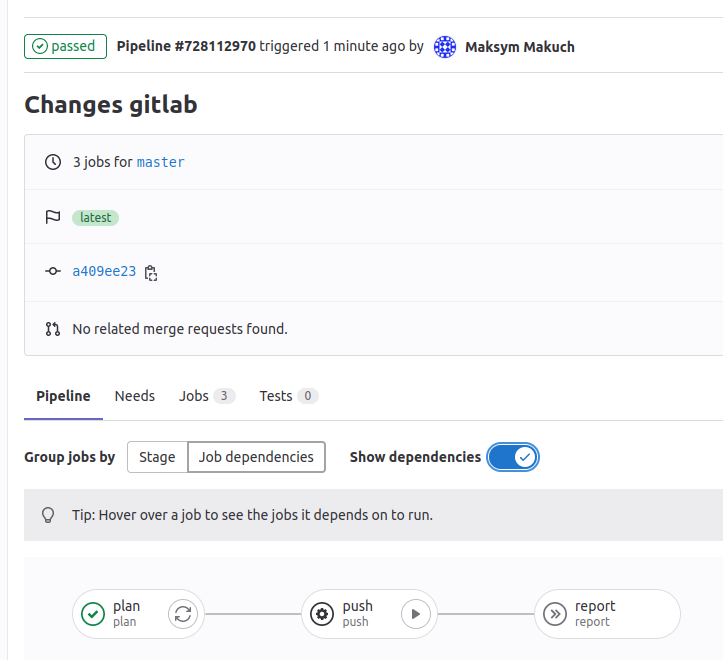

# Gitlab CI/CD

This directory contains Gitlab Pipeline.

### Prerequisites
* Add Baselime API key as `BASELIME_API_KEY` environment variable
* Add `.gitlab-ci.yml` to root of your repository of your observability code repository

### Pipeline steps
1. Checkout the code
2. Produce alerts reports