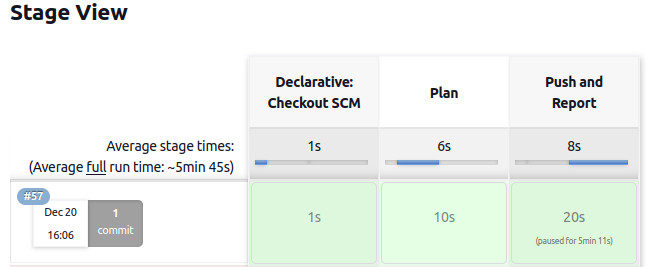

# Jenkins Pipeline

This directory contains Jenkins pipeline.

### Prerequisites
* Add Baselime API key to credentials as `baselime-api-key`
* Add `Jenkinsfile` to root of your repository of your observability code repository

### Pipeline steps
1. Checkout the code
2. Produce alerts reports